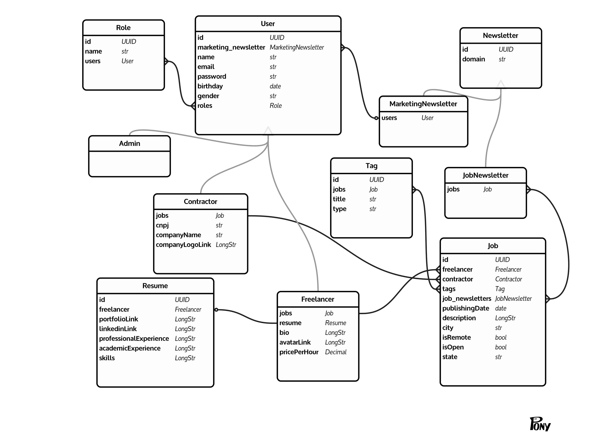

    <h1>TrampoZ - API</h1>
    

  

  

  

  

  

Índice:

- [🤔 O que é](#-o-que-é)
  - [Diagrama Entidade-Relacionamento](#diagrama-entidade-relacionamento)
- [🎯 Objetivos](#-objetivos)
- [🔬 Tecnologias utilizadas](#-tecnologias-utilizadas)
- [🚀 Executando a aplicação](#-executando-a-aplicação)
- [📝 Licença e créditos](#-licença-e-créditos)

## 🤔 O que é

TrampoZ é um plataforma ficticia para anúncio de trabalhos freelance.

Neste repositório foi desenvolvida uma API REST com Java vanilla e banco de dados Postgres dockerizado.
Confira outros repositórios relacionados:

- [TrampoZ UI (front-end em VueJS 3)](https://github.com/mrocha98/trampoz-ui)

### Diagrama Entidade-Relacionamento

Diagrama desenolvido com a ferramenta online [Pony ORM Editor](https://editor.ponyorm.com/).

## 🎯 Objetivos

Crie serviços REST que satisfaçam os seguintes requisitos:

1. Permita buscar um registro no Banco de Dados (BD) pelo seu ID por meio de
método GET. O retorno deve ser no formato JSON;
2. Permita inserção de registros em um BD por meio de método POST. O novo
registro deve ser recebido no corpo da requisição com formato JSON. Se a
requisição for processada com sucesso o código de retorno deve ser 201
(CREATED) e a resposta deve conter um cabeçalho (header) chamado
"Location" contendo a URL para o serviço criado no item 1 e o ID do registro
criado;
3. Permita alterar o conteúdo de um registro do BD por meio de método PUT ou
PATCH. Receba o ID do registro na URL e os dados a alterar como JSON no
corpo da requisição;
4. Permita excluir um registro por meio do método DELETE;
5. Utilize autenticação básica (envio de usuário e senha em toda requisição)
implementada com Filter e proíba a usuário sem autorização do tipo "ADMIN"
o acesso aos serviços dos itens 3 e 4. Tanto usuário como suas autorizações
devem ser recuperados de um banco de dados.

## 🔬 Tecnologias utilizadas

- Java 11
- Maven
- Hibernate
- Jetty Server
- Postgres 12
- Docker
- Docker Compose

## 🚀 Executando a aplicação

TODO

## 📝 Licença e créditos

Esse projeto foi desenvolvido sob a [licença BSD-3](https://github.com/mrocha98/trampoz-api/blob/master/LICENSE).

Icon made by <a href="http://www.freepik.com/" title="Freepik">Freepik</a> from <a href="https://www.flaticon.com/" title="Flaticon"> www.flaticon.com</a>
